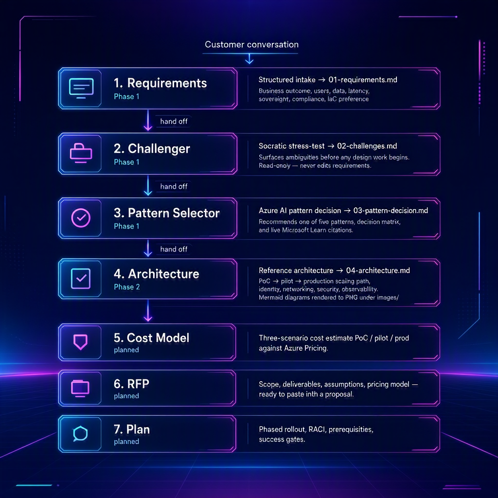

# AI Workload Planner — Copilot Template

A GitHub template repository for Microsoft partners that turns a customer conversation about an AI workload into a full pre-sales artifact pack — grounded in live Microsoft Learn docs, written by Copilot agents, reviewed by you.

Built on GitHub Copilot custom agents, skills, and the Microsoft Learn MCP server.

---

## The delivery flow

Each agent hands off to the next. You stay in VS Code throughout.




> **Steps 5–7 (Cost, RFP, Plan)** are reserved in the numbered convention and ship as templates only; their agents are planned. The Developer Guide is numbered `08` so the cost/RFP/plan slots stay open.

Every agent writes its artifact to `agent-output/<engagement-name>/` using the numbered convention. Nothing is shared with the customer until you review it.

---

## What the Pattern Selector chooses between

| Pattern | Use when |
|---------|----------|
| **AI Landing Zone for Foundry** | Enterprise or regulated workload; CAF Platform LZ exists or is planned; private networking required |
| **AI Gateway Landing Zone** | Multiple consumers, multi-model routing, central token quotas, or cross-team access governance (APIM layer — complements Foundry LZ) |
| **Lightweight Accelerator** | 4–8 week PoC, single team, no compliance scope, explicit willingness to rebuild for production |
| **Custom Build** | Edge, sovereign, on-prem hybrid, or highly specialised SKUs where no LZ fits |

---

## Who uses the artifacts (and how)

| Role | Primary artifact | What they take away |
|------|-----------------|---------------------|
| Commercial / bid lead | 00-evidence-pack | Source-linked capability evidence to paste into the RFP response |
| Solution / pre-sales architect | 03-pattern-decision, 04-architecture | Decision narrative, risks, gates, next workshop agenda |
| App developer / lead engineer | 04-architecture, 08-developer-guide | Integration surfaces, tool calls, data flows, code examples |
| Infra / platform engineer | 04-architecture | Networking stance, identity boundaries, environment separation |
| Security / compliance lead | 00-evidence-pack, 04-architecture | Data handling, sovereignty, auditability, retention |
| Commercial / account team | 05-cost-model, 06-rfp | Three-scenario pricing, RFP-ready scope and assumptions |

---

## Quick start

1. Click **Use this template → Create a new repository**. Choose **Private**.
2. Open the repo in VS Code with the GitHub Copilot extension (Business or Enterprise license recommended).
3. When prompted, allow the workspace to use the Microsoft Learn MCP server (configured in `.vscode/mcp.json`).
4. Open Copilot Chat, select the **Requirements** agent, and type:

   ```
   /start-engagement Contoso-RAG-Knowledge-Base
   ```

   > Have a customer RFP already? Start one step earlier: select the **Evidence Pack** agent, point it at the RFP, and it produces `00-evidence-pack.md`, then hands off to Requirements.

5. The agent creates `agent-output/Contoso-RAG-Knowledge-Base/` and guides you through intake. When it's done, click **Hand off to Challenger**.
6. Follow the handoff chain — Requirements → Challenger → Pattern Selector → Architecture → Developer Guide — reviewing and resolving `[TBD — ask customer]` items between steps.

---

## Project structure

```
.github/
  agents/                        # Custom Copilot agents (numbered to match artifacts)
    00-evidence-pack.agent.md
    01-requirements.agent.md
    02-challenger.agent.md
    03-pattern-selector.agent.md
    04-architecture.agent.md
    08-developer-guide.agent.md
  skills/                        # Reusable domain knowledge loaded by agents
    ai-landing-zone-decision/SKILL.md
    azure-evidence/SKILL.md
    ms-learn-grounding/SKILL.md
  instructions/                  # File-scoped rules (glob-targeted)
    agent-output.instructions.md
  prompts/                       # Reusable /commands
    start-engagement.prompt.md
  copilot-instructions.md        # Always-on context inherited by all agents
.vscode/
  mcp.json                       # Microsoft Learn MCP server wiring
agent-output/
  _template/                     # Numbered artifact templates (00–08)
  <engagement-name>/             # One folder per customer engagement
AGENTS.md                        # Agent roster and hand-off rules
```

---

## Status

| Phase | Agents | Artifacts |
|-------|--------|-----------|
| 1 | Evidence Pack, Requirements, Challenger, Pattern Selector | `00` `01` `02` `03` — **included** |
| 2 | Architecture | `04` — **included** |
| 3 | Developer Guide | `08` — **included** |
| 2 | Cost & Sizing | `05` — templates only, agent planned |
| 3 | RFP, Plan | `06` `07` — templates only, agents planned |
| 3 | IaC scaffolding | Bicep/Terraform gated by pattern decision — planned |

---

## Requirements

- VS Code (latest stable) with GitHub Copilot extension
- GitHub Copilot Business or Enterprise license (recommended for org-level agent sharing)
- Internet access — the Microsoft Learn MCP server is a hosted endpoint, no auth required

## Customization

| What to change | Where |
|---------------|-------|
| Evidence verification standard / source priority | `.github/skills/azure-evidence/SKILL.md` |
| AI LZ pattern decision rules | `.github/skills/ai-landing-zone-decision/SKILL.md` |
| Challenger tone (socratic vs. evaluative) | `.github/agents/02-challenger.agent.md` |
| Architecture depth / sections | `.github/agents/04-architecture.agent.md` |
| Add an MCP server (Azure Pricing, etc.) | `.vscode/mcp.json` + each agent's `tools:` list |


## The bigger story

This template is **stage 3 (Plan)** of a five-stage partner journey — Learn → Standardize → **Plan** → Land → Deploy. See **[STORY.md](STORY.md)** for the full map: the assets, Microsoft Learn links, and Copilot skills/agents/prompts that drive each stage, plus how this repo hands off to [APEX](https://github.com/jonathan-vella/apex) (and its work-in-progress AI-first variant, [APEX AI](https://github.com/rodanthi-alexiou/apex-ai)) for deploy-ready IaC. 
