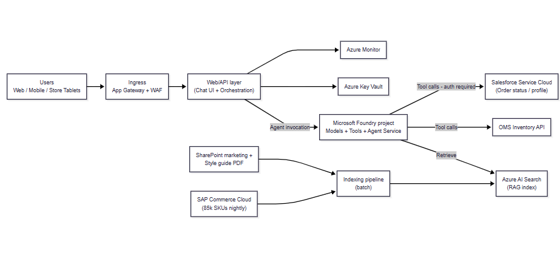
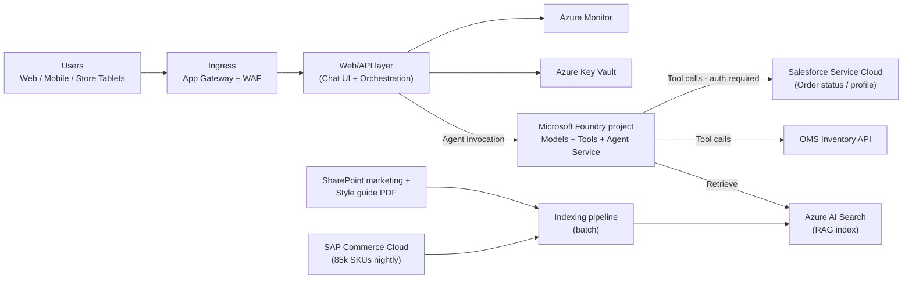
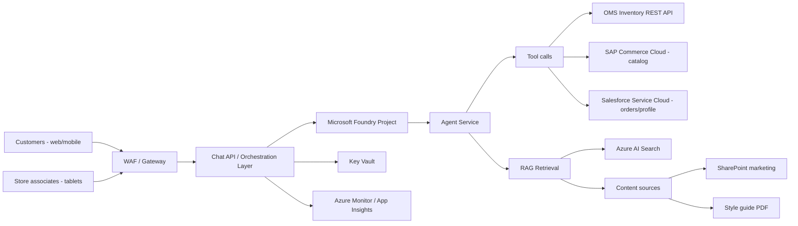

# Architecture — Moda Ibérica Shopping Assistant

## 0. Executive summary

This architecture is designed to support a customer-facing and associate-facing conversational assistant that:
- answers policy/promotions/sizing questions from curated content,
- retrieves product catalog context,
- calls tools for real-time store inventory,
- performs authenticated order-status lookups (WISMO),
- and scales from a controlled PoC to peak-season demand.

This document uses Microsoft’s baseline **Microsoft Foundry chat** architecture inside an Azure landing zone as the starting point ([source](https://learn.microsoft.com/azure/architecture/ai-ml/architecture/baseline-microsoft-foundry-landing-zone)).

## 1. Goals and scope

### 1.1 PoC (pilot) goals
- Validate customer value: product discovery + policy Q&A + store associate usefulness.
- Validate integration feasibility: catalog nightly sync, inventory API, SharePoint marketing content, style guide PDF.
- Validate security posture in principle for EU-only handling of customer data.

### 1.2 Out of scope (for the PoC unless explicitly approved)
- Full “no public endpoint” posture end-to-end (depends on network stance) [TBD — ask customer].
- Full call-center deflection automation (handoff workflows, CRM ticket creation) [TBD — ask customer].
- Fully automated product description generation publishing with no human review.

## 2. Non-negotiable constraints (from intake)

- **PII must remain in the EU** (GDPR + Spanish LOPDGDD noted). Region list and enforcement details are still [TBD — ask customer].
- **Peak demand**: estimated 2,000 concurrent users on Black Friday (typical 200–300).
- **Channels**: web + mobile + store tablets.
- **Languages**: Spanish, Catalan, Portuguese.

## 3. Gating decisions (must resolve before production)

These are the same blocking red flags from [agent-output/Moda-Iberica-Shopping-Assistant/02-challenges.md](agent-output/Moda-Iberica-Shopping-Assistant/02-challenges.md):
- WISMO authentication/authorization model (avoid PII leakage)
- Model procurement/licensing and fallback plan
- Network stance (private endpoints vs public access)
- Peak-event SLOs and operational readiness expectations
- EU-only requirement precision (EU vs single-country) + logging/retention rules

## 4. Use-cases → architecture responsibilities

| Use-case | Primary data sources | Runtime needs | Notes |
|---|---|---|---|
| Product discovery chat | SAP Commerce Cloud catalog (nightly), marketing content | Low-latency RAG + ranking | Catalog freshness policy required (nightly may be OK for browse, not for promos). |
| Outfit recommendations | Catalog + style guide | Recommendation logic + guardrails | Define “good” and evaluation set [TBD]. |
| Promotions / returns / sizing Q&A | SharePoint content + policy docs + style guide PDF | Retrieval + citations | Prefer curated sources; avoid “guessing” policy. |
| Store stock lookup | OMS REST API | Tool calling + timeouts | Degrade gracefully if OMS is slow/unavailable. |
| WISMO order status | Salesforce Service Cloud | AuthN/AuthZ + tool calling | High PII risk; must be gated behind strong identity. |
| Product description generation (internal) | Catalog attributes + merchandising rules | Separate workflow | Keep separate from customer chat; require human review [TBD]. |

## 5. Reference architecture (PoC)

### 5.1 High-level design

The PoC architecture follows Microsoft’s baseline Foundry-in-landing-zone pattern:
- A web/API layer hosts the chat UI and orchestration.
- A Foundry project hosts the model/agent runtime.
- Retrieval uses Azure AI Search.
- Secrets are stored in Key Vault.
- Observability uses Azure Monitor.

Microsoft’s baseline landing-zone architecture explicitly includes Foundry + Agent Service and private endpoints for dependencies ([source](https://learn.microsoft.com/azure/architecture/ai-ml/architecture/baseline-microsoft-foundry-landing-zone); [source](https://learn.microsoft.com/azure/architecture/ai-ml/architecture/baseline-microsoft-foundry-landing-zone#networking)).

### 5.2 Logical component diagram

Notes:
- Microsoft’s baseline uses Application Gateway + WAF and App Service as the web layer and shows private endpoints for Foundry, AI Search, Storage, Key Vault, and other dependencies ([source](https://learn.microsoft.com/azure/architecture/ai-ml/architecture/baseline-microsoft-foundry-landing-zone#architecture)).
- Foundry and projects are described as the core AI application platform resource boundary ([source](https://learn.microsoft.com/azure/foundry/what-is-foundry)).
- Agent runtime is provided by Foundry **Agent Service** ([source](https://learn.microsoft.com/azure/foundry/agents/overview)).

### 5.3 Data indexing approach (PoC)

- **SharePoint marketing content** and **style guide PDF**: ingest on schedule; index into Azure AI Search for retrieval.
- **Returns/sizing/policy content**: treat as authoritative; require that answers cite the retrieved sources.
- **Catalog**: nightly snapshot into a “browse index” in AI Search for product discovery.
- **Inventory**: do not index real-time inventory; call OMS tool at runtime.

## 6. Scaling architecture (pilot → production)

The key scaling step is to separate “stateless” and “stateful/limited” components and to add a governance layer where needed.

### 6.1 Phase A — PoC (controlled users)
- Single environment, EU region(s) only [TBD].
- Web/API layer scales horizontally.
- Limited tool surface: catalog + content retrieval + inventory.
- WISMO disabled or restricted to authenticated internal testers until authZ is defined.

### 6.2 Phase B — Pilot (real customers + associates)
Add:
- **Identity and authorization** for:
  - customer chat (anonymous vs logged-in) [TBD]
  - store associates (workforce identity) [TBD]
- WISMO enabled only for authenticated users and only for “own orders”.
- Clear “degrade modes” for each tool call (inventory down, Salesforce down).

### 6.2.1 WISMO gating policy (order status)

**Goal:** enable “Where Is My Order?” without exposing customer PII or allowing cross-customer access.

**Principles (all phases):**
- **Server-side authorization is mandatory.** Never trust user-provided identifiers (order number, email) without verifying the authenticated principal.
- **Data minimization by default.** Return only what the experience needs (for example: status, carrier + tracking link). Avoid returning full addresses, payment data, or full customer profiles.
- **Prompt/log hygiene.** Do not place raw PII into prompts, retrieval indexes, or routine logs/traces; store only what is required for operations and debugging [TBD — ask customer].
- **Explainable failure modes.** If the WISMO tool is unavailable or the user is not authorized, the assistant must respond with a safe message (for example: “Please sign in to view order status.”).

**Identity and authorization (end-to-end):**
- **Identity provider choice**
  - **Customers:** use a CIAM-capable tenant configuration (Microsoft Entra External ID external tenant) if this is a consumer/customer sign-in scenario ([source](https://learn.microsoft.com/entra/external-id/tenant-configurations#external-tenants); [source](https://learn.microsoft.com/entra/external-id/customers/overview-customers-ciam)).
  - **Store associates:** use the workforce tenant for employee sign-in (identity provider and tenant details are [TBD — ask customer]).
  - App Service authentication documentation distinguishes “workforce” vs “external configuration” for Microsoft Entra sign-in, depending on whether the app serves employees or consumers/business customers ([source](https://learn.microsoft.com/azure/app-service/configure-authentication-provider-aad)).

- **Front-end → API authentication**
  - The user signs in and the client calls the chat API with an access token (JWT).
  - The chat API enforces sign-in using platform or app authentication. If the web/API layer is App Service, built-in authentication and authorization (“Easy Auth”) can handle sign-in and access control at the platform edge ([source](https://learn.microsoft.com/azure/app-service/overview-authentication-authorization)).

- **Optional gateway enforcement (recommended for defense-in-depth)**
  - If traffic goes through API Management, validate the presented JWT at the gateway using `validate-jwt` and OpenID configuration metadata (issuer/audience/claims checks) before forwarding to the backend ([source](https://learn.microsoft.com/azure/api-management/validate-jwt-policy); [source](https://learn.microsoft.com/azure/api-management/api-management-howto-protect-backend-with-aad#configure-a-jwt-validation-policy-to-pre-authorize-requests)).
  - The backend should still perform its own authorization checks (gateway validation is not a substitute for backend authorization).

- **Authorization model for WISMO (the “own orders only” rule)**
  - The API must map the authenticated principal to an internal customer identity (customer account ID, loyalty ID, or equivalent) [TBD — ask customer].
  - The order-status tool call must be constrained by that identity (for example: query by customer ID + order ID, not by order ID alone) [TBD — ask customer].
  - For associates, enforce role-based access and require explicit auditing for privileged actions [TBD — ask customer].

- **Service-to-service credentials (avoid secrets in code)**
  - Use managed identities where Azure dependencies support Microsoft Entra authentication, to avoid embedding secrets in application code ([source](https://learn.microsoft.com/entra/identity/managed-identities-azure-resources/overview)).

**Phase A — PoC (controlled users):**
- Default **OFF** for external users.
- If enabled for testing: internal testers only, read-only order status, and no search/browse capability (must supply a known test order).
- Log only non-PII request metadata (timestamp, outcome, latency); full audit requirements [TBD — ask customer].

**Phase B — Pilot (real customers + associates):**
- **Customers:** logged-in only; allow lookup of **own orders only**.
- **Associates:** gated by role; allow only the minimum required workflow.
  - Recommended starting point: associates can view status only after an explicit customer-present interaction (process definition [TBD — ask customer]).
  - Any broadened access (search by customer name/email, view address/phone) requires explicit approval and full auditing.
- Add rate limits and abuse detection (to prevent enumeration of order numbers).

**Phase C — Production + peak season:**
- Enforce a formal access model:
  - Customer access scope (own orders, guest orders, shared accounts) [TBD — ask customer].
  - Associate access scope (which attributes, which roles, which reason codes) [TBD — ask customer].
- Implement full auditing for privileged access (associate lookups), and align retention to EU-only and privacy requirements [TBD — ask customer].
- Add explicit degradation behavior for peak events (tool timeouts, circuit breakers, “try again later” messaging) so WISMO failures don’t cascade.

### 6.3 Phase C — Production + peak season
Add:
- **API gateway for GenAI traffic** if required for central throttling, token metering, and peak smoothing.
  - Microsoft documents a GenAI gateway scenario on top of the API Management landing zone accelerator and links it to the gateway offloading pattern ([source](https://learn.microsoft.com/azure/cloud-adoption-framework/scenarios/app-platform/api-management/landing-zone-accelerator#generative-ai-gateway-scenario); [source](https://learn.microsoft.com/azure/architecture/ai-ml/guide/azure-openai-gateway-guide)).
  - Azure API Management has “AI gateway” capabilities for GenAI workloads ([source](https://learn.microsoft.com/azure/api-management/genai-gateway-capabilities)).
- **Quota and cost guardrails**: per-session token budgets, adaptive rate limits, and fallback model strategy [TBD].
- **Operational readiness**: SLOs, on-call, runbooks, incident drills aligned to peak season and DORA readiness work [TBD].

## 7. Security and compliance posture

### 7.1 Landing zone foundation
Microsoft guidance emphasizes using Azure landing zones as the foundation and treating AI as a workload deployed into application landing zones ([source](https://learn.microsoft.com/azure/cloud-adoption-framework/ready/landing-zone/#application-landing-zone-accelerators)).

### 7.2 Network isolation
The Foundry-in-landing-zone baseline calls out private endpoint and DNS requirements for Foundry and Agent Service dependencies ([source](https://learn.microsoft.com/azure/architecture/ai-ml/architecture/baseline-microsoft-foundry-landing-zone#networking)).

**PoC recommendation:** adopt the baseline’s private endpoint posture as early as possible to avoid a “pilot → rewrite” trap. If Moda Ibérica explicitly accepts public endpoints for PoC, record that as a time-boxed exception [TBD — ask customer].

### 7.3 Data handling
- Define prompt/logging rules so that PII is not copied into prompts, retrieval indexes, or logs (policy required) [TBD].
- Define retention and right-to-be-forgotten propagation for transcripts and indexes [TBD].

For overall AI environment readiness guidance (including internal vs internet-facing workload separation), see CAF “Establish an AI foundation” ([source](https://learn.microsoft.com/azure/cloud-adoption-framework/ai/ready#establish-an-ai-foundation)).

## 8. Observability and evaluation

- Centralized monitoring and diagnostics are part of the baseline Foundry landing zone architecture via Azure Monitor ([source](https://learn.microsoft.com/azure/architecture/ai-ml/architecture/baseline-microsoft-foundry-landing-zone)).
- Add intent-level KPIs and evaluation harness aligned to success metrics (conversion lift, deflection, associate rating) [TBD — ask customer on measurement plan].

## 9. Open items for next workshop

- Confirm PoC MVP (what ships by Oct 2026) vs post-peak backlog.
- Confirm identity model for customers and associates; confirm WISMO authorization rules.
- Confirm EU-only requirement scope (EU vs Spain) and approved Azure regions.
- Confirm network stance and whether private endpoints are mandatory in PoC.
- Confirm whether an APIM GenAI gateway is required for quotas/throttling/token tracking.

## Citations

| Claim | Source | Fetch date |
|---|---|---|
| Foundry-in-landing-zone baseline reference architecture | https://learn.microsoft.com/azure/architecture/ai-ml/architecture/baseline-microsoft-foundry-landing-zone | 2026-05-27 |
| Foundry-in-landing-zone networking dependencies | https://learn.microsoft.com/azure/architecture/ai-ml/architecture/baseline-microsoft-foundry-landing-zone#networking | 2026-05-27 |
| What is Microsoft Foundry | https://learn.microsoft.com/azure/foundry/what-is-foundry | 2026-05-27 |
| Foundry Agent Service overview | https://learn.microsoft.com/azure/foundry/agents/overview | 2026-05-27 |
| Azure landing zones: AI workloads are deployed into application landing zones | https://learn.microsoft.com/azure/cloud-adoption-framework/ready/landing-zone/#application-landing-zone-accelerators | 2026-05-27 |
| CAF: Establish an AI foundation | https://learn.microsoft.com/azure/cloud-adoption-framework/ai/ready#establish-an-ai-foundation | 2026-05-27 |
| APIM landing zone accelerator GenAI gateway scenario | https://learn.microsoft.com/azure/cloud-adoption-framework/scenarios/app-platform/api-management/landing-zone-accelerator#generative-ai-gateway-scenario | 2026-05-27 |
| Gateway offloading pattern for AOAI and other LMs | https://learn.microsoft.com/azure/architecture/ai-ml/guide/azure-openai-gateway-guide | 2026-05-27 |
| AI gateway in Azure API Management | https://learn.microsoft.com/azure/api-management/genai-gateway-capabilities | 2026-05-27 |

This follows Microsoft’s baseline Foundry chat-in-landing-zone architecture but is described here as an actionable PoC shape.

### 3.1 Logical components

- **Client channels**
  - Website chat widget
  - Mobile app chat UI
  - Store associate tablet UI
- **Edge + security**
  - Web application firewall (WAF) in front of the chat UI/API layer (baseline architecture uses Azure Application Gateway + WAF) ([source](https://learn.microsoft.com/azure/architecture/ai-ml/architecture/baseline-microsoft-foundry-landing-zone#architecture)).
- **App orchestration layer**
  - Stateless “chat API” that owns session handling, policy enforcement, and tool calling.
  - In the baseline, this layer is hosted on App Service ([source](https://learn.microsoft.com/azure/architecture/ai-ml/architecture/baseline-microsoft-foundry-landing-zone#architecture)).
- **AI platform**
  - **Microsoft Foundry** resource + project(s) for the workload ([source](https://learn.microsoft.com/azure/foundry/what-is-foundry)).
  - **Agent Service** as the agent runtime/orchestration layer (supports prompt-based and hosted agents) ([source](https://learn.microsoft.com/azure/architecture/ai-ml/architecture/baseline-microsoft-foundry-landing-zone#architecture)).
- **Knowledge + retrieval**
  - Azure AI Search for retrieval and indexing (baseline includes it as a private-endpoint dependency) ([source](https://learn.microsoft.com/azure/architecture/ai-ml/architecture/baseline-microsoft-foundry-landing-zone#networking)).
  - Storage for document ingestion artifacts (baseline includes Storage private endpoints) ([source](https://learn.microsoft.com/azure/architecture/ai-ml/architecture/baseline-microsoft-foundry-landing-zone#networking)).
- **Secrets + config**
  - Azure Key Vault (baseline includes Key Vault private endpoints) ([source](https://learn.microsoft.com/azure/architecture/ai-ml/architecture/baseline-microsoft-foundry-landing-zone#networking)).
- **Observability**
  - Azure Monitor / Application Insights as per baseline ([source](https://learn.microsoft.com/azure/architecture/ai-ml/architecture/baseline-microsoft-foundry-landing-zone)).

### 3.2 Networking stance for PoC

Two valid PoC approaches, depending on CISO stance:

- **PoC-A (recommended if CISO wants strict controls):** follow the baseline landing-zone networking dependency set (private endpoints + private DNS, controlled egress) ([source](https://learn.microsoft.com/azure/architecture/ai-ml/architecture/baseline-microsoft-foundry-landing-zone#networking)).
- **PoC-B (only if explicitly accepted):** start with public endpoints for select services and tighten later. *This is a conscious tradeoff; it must be approved in writing by security.*

### 3.3 Mermaid (logical view)

---

## 4. Use-case mapping (PoC vs scaled)

| Use case | PoC behavior | Production-scale behavior | Key risks / gates |
|---|---|---|---|
| Product discovery | RAG over catalog summaries + controlled catalog lookups | Same, plus stronger caching and governance | Catalog freshness and correctness [TBD] |
| Outfit recommendations | Rules + retrieval from style guide (text) | Potentially add richer signals (preferences) | Quality evaluation [TBD] |
| Promotions / returns / sizing | RAG over marketing + policy docs | Same, with content QA and “source” display | Stale promo risk |
| Store stock check | Tool call to OMS inventory REST API | Same + circuit-breakers/timeouts and fallbacks | OMS latency/SLA [TBD] |
| WISMO (order status) | **Defer or restrict to authenticated users only** | Full flow with strict authN/authZ and auditing | PII leakage red flag (C-08) |
| Copywriting (SKU descriptions) | Internal-only assistant mode + human review | Same with governance workflow | Brand/legal exposure (C-10) |

---

## 5. Scaling path (PoC → Pilot → Black Friday)

### 5.1 Phase 0 — PoC (4–8 weeks)

- Implement chat UI + chat API.
- Implement *low-risk* tool calls (catalog, inventory) and RAG for marketing/style guide.
- Keep WISMO off or strictly authenticated.

### 5.2 Phase 1 — Pilot (8–12 weeks)

- Add store associate identity + role-based tool authorization.
- Add multilingual QA loop and terminology glossary governance.
- Start collecting evaluation datasets from real interactions (guardrails + privacy).

### 5.3 Phase 2 — Peak readiness (Oct 2026)

- Add an **AI gateway** if we need centralized traffic shaping, token tracking, or multi-backend routing.
  - API Management provides GenAI gateway capabilities ([source](https://learn.microsoft.com/azure/api-management/genai-gateway-capabilities)).
  - Microsoft provides an APIM landing zone accelerator with a GenAI gateway scenario ([source](https://learn.microsoft.com/azure/cloud-adoption-framework/scenarios/app-platform/api-management/landing-zone-accelerator#generative-ai-gateway-scenario)).
  - Microsoft documents gateway offloading patterns for Azure OpenAI and other LMs ([source](https://learn.microsoft.com/azure/architecture/ai-ml/guide/azure-openai-gateway-guide)).
- Introduce explicit *degradation modes* (for example: “inventory temporarily unavailable”, “order status requires login”).
- Formalize on-call/runbooks and SLOs (DORA readiness alignment) [TBD — ask customer].

---

## 6. Data, residency, and compliance notes (EU-only)

- **EU-only constraint** must be translated into explicit engineering rules:
  - What is allowed in prompts?
  - What is allowed in retrieval indexes?
  - What is allowed in logs/traces?
  - How right-to-be-forgotten propagates across transcripts and indexes?
- Cloud Adoption Framework guidance recommends establishing an AI foundation aligned to governance and workload segmentation ([source](https://learn.microsoft.com/azure/cloud-adoption-framework/ai/ready#establish-an-ai-foundation)).

**[TBD — ask customer]**: Approved Azure regions list, and whether “EU-only” means “EU boundary” or “Spain only”.

---

## 7. Architecture decisions to confirm (gating)

These are the minimum decisions to lock before committing to the final production pattern:

- **C-08 (WISMO):** authentication and authorization model (logged in only? guest orders?)
- **C-11/C-18:** data classification + EU-only enforcement rules (prompts, logs, traces)
- **C-17:** network posture for Foundry and dependent services (private endpoints required?)
- **C-09:** model procurement/licensing and fallback model plan
- **C-15:** peak availability targets + incident response expectations

---

## 8. Citations

| Topic | Source | Fetch date |
|---|---|---|
| AI workloads in Azure landing zones (no separate “AI LZ” required) | https://learn.microsoft.com/azure/cloud-adoption-framework/ready/landing-zone/#application-landing-zone-accelerators | 2026-05-27 |
| Baseline Foundry chat reference architecture in an Azure landing zone | https://learn.microsoft.com/azure/architecture/ai-ml/architecture/baseline-microsoft-foundry-landing-zone | 2026-05-27 |
| Foundry landing-zone networking dependencies | https://learn.microsoft.com/azure/architecture/ai-ml/architecture/baseline-microsoft-foundry-landing-zone#networking | 2026-05-27 |
| What is Microsoft Foundry | https://learn.microsoft.com/azure/foundry/what-is-foundry | 2026-05-27 |
| AI gateway capabilities in Azure API Management | https://learn.microsoft.com/azure/api-management/genai-gateway-capabilities | 2026-05-27 |
| APIM landing zone accelerator (GenAI gateway scenario) | https://learn.microsoft.com/azure/cloud-adoption-framework/scenarios/app-platform/api-management/landing-zone-accelerator#generative-ai-gateway-scenario | 2026-05-27 |
| Gateway offloading pattern guide | https://learn.microsoft.com/azure/architecture/ai-ml/guide/azure-openai-gateway-guide | 2026-05-27 |
| Establish an AI foundation (CAF) | https://learn.microsoft.com/azure/cloud-adoption-framework/ai/ready#establish-an-ai-foundation | 2026-05-27 |
