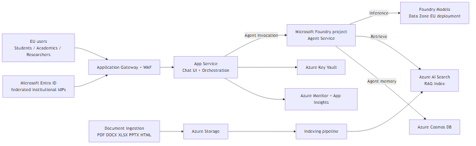
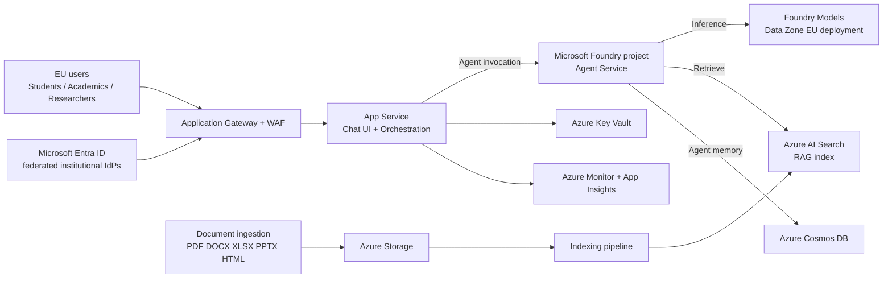
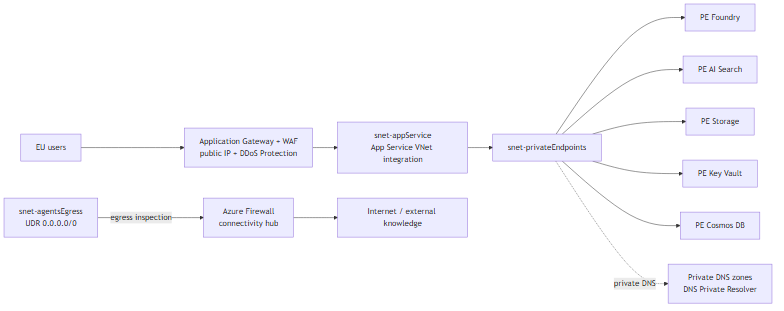
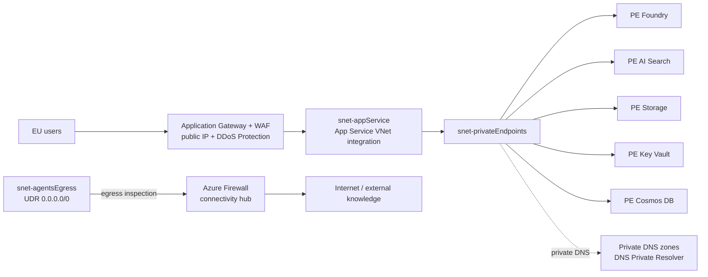

# Architecture — Sofia Center

## 0. Audience (partner side)

This pre-sales architecture is intended to be useful to:

- **Solution architect / pre-sales architect** (story, tradeoffs, gates)
- **Infra/platform engineer** (networking, identity boundaries, operations)
- **App developer / lead engineer** (integration surfaces, tool calls, data flows)
- **Security/compliance lead** (data handling, auditability, retention)

> **⚠️ Read the gating decisions first (§3).** Per [03-pattern-decision.md](03-pattern-decision.md), the target pattern is **AI Landing Zone for Foundry**, but **C-02** (5-month deadline with no CAF platform landing zone yet) is an open **blocker**. This architecture describes the *target* PoC and production shapes; committing to a production milestone is gated on an agreed phased scope.

## 1. Executive summary (SA-facing)

- **What we are building:** An EU/EEA-resident, private-networked AI assistant platform (chat + RAG document Q&A) for the Sofia Center higher-education and research community, built as a *workload-owned* **Microsoft Foundry** application landing zone on top of a CAF platform landing zone ([Baseline Microsoft Foundry chat reference architecture in an Azure landing zone](https://learn.microsoft.com/azure/architecture/ai-ml/architecture/baseline-microsoft-foundry-landing-zone)).
- **Who it serves:** ~100,000 university students, academics, and researchers, with federated institutional sign-in via Microsoft Entra ID ([01-requirements.md](01-requirements.md), §2, §6).
- **What success looks like:** Grounded, low-latency answers over curated EU-resident content, with GDPR-compliant data handling, enforceable EU-only processing, and the ability to scale from a PoC to exam-period peak load.
- **What is explicitly out of scope (this document):** Pricing/sizing (Cost phase), IaC (Phase 3), final region selection, and the end-user application build ownership (C-08) — all `[TBD — ask customer]`.

The architecture starts from Microsoft's baseline Foundry-in-landing-zone reference, which deploys the workload across an application-landing-zone spoke (workload components) and a platform-owned connectivity hub (firewall, DNS, egress) ([Baseline Foundry LZ — Networking](https://learn.microsoft.com/azure/architecture/ai-ml/architecture/baseline-microsoft-foundry-landing-zone#networking)).

## 2. Scope and assumptions

### 2.1 PoC scope
- A single application-landing-zone spoke with the core workload: App Service chat UI + orchestration, a Foundry project (models + Agent Service), Azure AI Search (RAG), Storage (ingestion), Key Vault, and Azure Cosmos DB (Agent Service memory) ([Baseline Foundry LZ — Architecture](https://learn.microsoft.com/azure/architecture/ai-ml/architecture/baseline-microsoft-foundry-landing-zone#architecture)).
- **Bounded RAG** over a curated EU-resident document corpus (PDF/DOCX/XLSX/PPTX/HTML) for a defined pilot persona set — narrowing the C-01 scope ambiguity to "grounded answers from curated sources."
- Private-endpoint posture adopted from day one (see §2.4) to avoid a pilot-to-prod rewrite.
- A single EU region; flagship-tier model chosen from the EU Data Zone–available set (see C-04, §3).

### 2.2 Pilot scope
- Real federated users from a limited number of institutions (validates C-06 federation scale).
- Per-segment quotas/observability and a documented GDPR erasure flow (C-05) added.
- Operational SLOs, dashboards, and alerting established (C-09).

### 2.3 Production / peak scope
- Hardened, governed multi-environment deployment (PoC/pilot/prod separation) sized for exam-period peak concurrency (C-03), with availability-zone–aware regions and a documented resilience stance for a single-region incident (C-09).
- Optional APIM AI gateway in front of Foundry for central token quotas, throttling, and multi-model routing if per-segment governance requires it.

### 2.4 Key assumptions
- **Peak concurrency ~5,000–7,000** is a partner planning estimate, **not customer-validated** — exam-period peaks may be 3–5× higher (C-03) `[TBD — ask customer]`.
- **EU-only processing** is a hard requirement; enforced via Azure Policy + Data Zone (EU) deployments (see §7) `[confirm exact region]`.
- A **CAF platform landing zone is a prerequisite** and does not exist yet; AI is deployed as an application landing zone on top of it ([AI Ready](https://learn.microsoft.com/azure/cloud-adoption-framework/ai/ready)) `[TBD — platform foundation owner/timeline]`.
- End-user application build ownership and the 5-month phasing are unresolved (C-02, C-08) `[TBD — ask customer]`.

## 3. Gating decisions (must resolve before build)

Unresolved red flags carried from [02-challenges.md](02-challenges.md):

- **C-02 (Blocker):** 5-month deadline with no platform landing zone, plus an unscoped platform + workload + application build. **Agree a phased "minimum at month 5" before committing a production milestone.**
- **C-04 (High risk):** Strict EU-only residency may exclude the newest flagship models in the target region. The customer must own the model-vs-residency tradeoff; flagship tier must be chosen from the EU Data Zone–available set ([Region availability — Data Zone Batch](https://learn.microsoft.com/azure/foundry/foundry-models/concepts/models-sold-directly-by-azure-region-availability#data-zone-batch)).
- **C-01:** RAG vs open-ended general assistant — scope must be bounded before cost/safety design.
- **C-03 / C-07:** Unvalidated peak concurrency and no budget ceiling — both cascade into sizing and cost (Cost phase).
- **C-05:** Right-to-be-forgotten propagation into the vector index, transcripts, and logs is undesigned.
- **C-06:** Number of federated institutional IdPs is unknown and drives identity design and timeline.
- **C-09:** 99.5% — internal target vs contractual SLA, and single-region resilience expectation, unconfirmed.

## 4. Reference architecture (logical)

### 4.1 Logical component diagram

Component grounding:
- **App Service** hosts the chat UI and orchestration layer, using regional VNet integration with `vnetRouteAllEnabled` so egress is forced through the platform hub ([Baseline Foundry LZ — Networking](https://learn.microsoft.com/azure/architecture/ai-ml/architecture/baseline-microsoft-foundry-landing-zone#networking)).
- **Microsoft Foundry** resource + project is the AI application platform where models are deployed and agents are hosted; each project exposes an endpoint clients use ([Baseline Foundry LZ — Architecture](https://learn.microsoft.com/azure/architecture/ai-ml/architecture/baseline-microsoft-foundry-landing-zone#architecture)).
- **Agent Service** is the cloud-native agent runtime; its dependencies (AI Search, Storage, Cosmos DB) are reached over private endpoints ([Baseline Foundry LZ — Architecture](https://learn.microsoft.com/azure/architecture/ai-ml/architecture/baseline-microsoft-foundry-landing-zone#architecture)).
- **Azure AI Search, Storage, Key Vault, Cosmos DB** are all private-endpoint dependencies in the baseline ([Baseline Foundry LZ — Networking](https://learn.microsoft.com/azure/architecture/ai-ml/architecture/baseline-microsoft-foundry-landing-zone#networking)).
- **Azure Monitor, Azure Monitor Logs, and Application Insights** provide observability for all workload components; **Azure Policy** applies workload governance ([Baseline Foundry LZ — Architecture](https://learn.microsoft.com/azure/architecture/ai-ml/architecture/baseline-microsoft-foundry-landing-zone#architecture)).

### 4.2 Networking (private endpoints + hub egress)

Networking grounding:
- All spoke subnets carry a `0.0.0.0/0` UDR that routes internet-bound traffic to the platform hub's **Azure Firewall**; ingress-facing Application Gateway and its public IP sit in the spoke and require **DDoS Protection** coverage ([Baseline Foundry LZ — Networking](https://learn.microsoft.com/azure/architecture/ai-ml/architecture/baseline-microsoft-foundry-landing-zone#networking)).
- The platform team hosts **private DNS zones** for the Foundry FQDNs (`privatelink.services.ai.azure.com`, `privatelink.openai.azure.com`, `privatelink.cognitiveservices.azure.com`) and Agent Service dependencies (`privatelink.search.windows.net`, `privatelink.blob.core.windows.net`, `privatelink.documents.azure.com`); DNS must resolve from inside the spoke **before** the Agent Service capability host is deployed or deployment fails ([Baseline Foundry LZ — Networking](https://learn.microsoft.com/azure/architecture/ai-ml/architecture/baseline-microsoft-foundry-landing-zone#networking)).
- Request a `/22` contiguous spoke address space; the Agent Service integration subnet must sit within a `/24` and use a valid private prefix ([Baseline Foundry LZ — Subscription setup](https://learn.microsoft.com/azure/architecture/ai-ml/architecture/baseline-microsoft-foundry-landing-zone#subscription-setup)).

### 4.3 Key runtime flows

- **User chat flow:** EU user → Entra sign-in → Application Gateway/WAF → App Service (token validated) → Foundry project/Agent Service → model inference on an EU Data Zone deployment → streamed response.
- **Retrieval (RAG) flow:** Curated documents → Storage → indexing pipeline → Azure AI Search index; at query time Agent Service retrieves grounding chunks from AI Search over a private endpoint and requires answers to cite retrieved sources (bounds C-01).
- **Tool calling flow:** Agent Service invokes workload-scoped tools; any internet-bound tool egress is inspected by the hub firewall, and NSGs constrain the agent egress subnet ([Baseline Foundry LZ — Considerations](https://learn.microsoft.com/azure/architecture/ai-ml/architecture/baseline-microsoft-foundry-landing-zone#considerations)).

## 5. Identity (end-to-end)

The platform serves **workforce-style federated identities** (students/staff/researchers from institutional IdPs), not anonymous consumers. Microsoft Entra ID is the federation point for institutional SAML 2.0 / OpenID Connect / WS-Fed providers ([01-requirements.md](01-requirements.md), §6).

1. **User sign-in:** The user authenticates through their institutional IdP federated to Microsoft Entra ID; Entra ID issues the token after the user completes sign-in on the Entra-hosted flow ([Authenticate applications and users with Microsoft Entra ID](https://learn.microsoft.com/entra/architecture/authenticate-applications-and-users#request-tokens)).
2. **Token type:** The client calls the chat API with an OAuth 2.0 **access token (JWT)** in the `Authorization: Bearer` header.
3. **Where the token is validated:**
   - **Platform edge (App Service):** App Service built-in authentication ("Easy Auth") can enforce sign-in and inject validated claims via the `x-ms-client-principal` header for the app to consume ([Configure App Service for Microsoft Entra sign-in — Authorize requests](https://learn.microsoft.com/azure/app-service/configure-authentication-provider-aad#authorize-requests); [Authentication and authorization in App Service](https://learn.microsoft.com/azure/app-service/overview-authentication-authorization)).
   - **Optional gateway (defense-in-depth):** if APIM fronts the API, validate the JWT at the gateway with the `validate-azure-ad-token` policy (issuer/audience/tenant/claims checks) before forwarding ([Validate Microsoft Entra token policy](https://learn.microsoft.com/azure/api-management/validate-azure-ad-token-policy#examples)).
4. **Server-side authorization:** App Service authentication handles *authentication* only; the application must make **authorization** decisions in code using the mapped claims (e.g., institution/role/entitlement) — built-in checks alone may be insufficient ([Configure App Service for Microsoft Entra sign-in — Authorize requests](https://learn.microsoft.com/azure/app-service/configure-authentication-provider-aad#authorize-requests)). For a multi-institution federation, validate the **issuer/tenant** of each request against the allowed set ([same source](https://learn.microsoft.com/azure/app-service/configure-authentication-provider-aad#authorize-requests)).
5. **Service-to-service identity:** Use **managed identities** for the workload's access to Azure dependencies (Foundry, AI Search, Storage, Key Vault, Cosmos DB) to avoid secrets in code ([Managed identities for Azure resources](https://learn.microsoft.com/entra/identity/managed-identities-azure-resources/overview)).

Open identity items: **C-06** federation scale (1 national IdP vs many institutional IdPs) drives whether a single federation or per-tenant trust model is used `[TBD — ask customer]`.

## 6. Monitoring and observability

Centralized observability is part of the baseline: **Azure Monitor + Azure Monitor Logs + Application Insights** collect, store, and visualize telemetry for all workload components ([Baseline Foundry LZ — Architecture](https://learn.microsoft.com/azure/architecture/ai-ml/architecture/baseline-microsoft-foundry-landing-zone#architecture)).

- **What to instrument:**
  - **Chat API / orchestration:** request rate, first-token latency, full-response latency, error rate, and per-request token usage.
  - **Agent Service / tool calls:** tool invocation success/failure, latency, and timeouts.
  - **Retrieval:** AI Search query latency, hit rate, and grounding-source coverage.
  - **Identity events:** sign-in success/failure and authorization denials (without logging token contents).
  - **Dependency health:** Foundry, AI Search, Storage, Key Vault, Cosmos DB availability.
- **Minimum operational dashboards & alerting:** latency (p50/p95), error rate, throttling/quota saturation, and dependency health, with alerts on latency-target breach and error-rate spikes (supports the C-09 SLO discussion).
- **What must not be logged:** prompts/responses containing GDPR-scoped personal data, raw tokens, and document content must be excluded from routine logs/traces; enforcement point and redaction rules `[TBD — ask customer]`.
- **Retention & access controls** for logs/traces (aligned to GDPR retention and erasure, C-05) `[TBD — ask customer]`.

## 7. Governance

- **Environment separation & management groups:** Separate management groups for **internet-facing vs internal** AI workloads to establish a data-governance boundary, with policy inheritance per ALZ principles ([AI Ready — AI governance](https://learn.microsoft.com/azure/cloud-adoption-framework/ai/ready)). Maintain PoC/pilot/prod separation with promotion gates and CI/CD ([Manage AI — deployment](https://learn.microsoft.com/azure/cloud-adoption-framework/ai/manage#manage-ai-deployment)).
- **Policy-driven guardrails:** Apply **Azure Policy** built-in definitions for Foundry and AI Search, and enable the Azure landing zone **workload-specific** policy initiatives (e.g., Enforce-Guardrails for Azure OpenAI) ([Govern Azure platform services (PaaS) for AI](https://learn.microsoft.com/azure/cloud-adoption-framework/ai/platform/governance)). Start **audit-first**, then tighten to enforcement to avoid blocking the build ([Governance and security for AI agents — Prepare environment](https://learn.microsoft.com/azure/cloud-adoption-framework/ai-agents/governance-security-across-organization#prepare-environment)).
- **EU residency enforcement (C-04):** Use **Azure Policy to deny "Global" deployment types** and use **Data Zone (EU)** deployments so inference stays within EU Member Nations and data at rest stays in the resource's Geo ([EU Data Boundary — optional capabilities](https://learn.microsoft.com/privacy/eudb/eu-data-boundary-transfers-for-optional-capabilities); [Deployment types — data processing locations](https://learn.microsoft.com/azure/ai-foundry/openai/how-to/deployment-types#azure-ai-foundry-deployment-data-processing-locations)). Enforce content-filter settings and a disallowed-model list via policy ([Manage AI — deployment](https://learn.microsoft.com/azure/cloud-adoption-framework/ai/manage#manage-ai-deployment)).
- **Tooling allowlist:** Maintain an allowlist of agent tools/connections; high-risk or internet-egress tools require approval and firewall application rules at the hub ([Baseline Foundry LZ — Considerations](https://learn.microsoft.com/azure/architecture/ai-ml/architecture/baseline-microsoft-foundry-landing-zone#considerations)).
- **Data handling rules** for prompts, retrieval indexes, and transcripts, and a **time-boxed, approved-by policy-exception** process with auditability `[TBD — ask customer]`.

## 8. Scaling path (PoC → pilot → production)

- **Phase A — PoC:** Single spoke, private endpoints from day one, bounded RAG over curated EU content, one EU region, flagship model from the EU Data Zone set. WISMO-style high-risk tools and broad federation deferred. Audit-first policy.
- **Phase B — Pilot:** Onboard a limited set of institutional IdPs (validates C-06); add per-segment quotas and dashboards/alerting (C-09); implement and test the GDPR erasure flow across index/transcripts/logs (C-05); tighten policy from audit to enforce.
- **Phase C — Production / peak:** Availability-zone–aware region(s); documented single-region incident behavior or a second EU region for resilience (C-09); capacity sized for exam-period peak (C-03) with PTU/quota planning (Cost phase); optional **APIM AI gateway** for central token quotas, throttling, and multi-model routing across segments.

## 9. Next workshop agenda (pre-sales)

- **Objective:** close gating decisions (C-02, C-04 first) and validate architecture assumptions.
- **Required attendees:** customer security/identity owner (C-06), application owner (C-01/C-08), data owner/DPO (C-04/C-05), operations/SRE + budget owner (C-03/C-07/C-09), and the platform/network owner for the prerequisite platform landing zone `[TBD — ask customer]`.
- **Pre-read:** [01-requirements.md](01-requirements.md), [02-challenges.md](02-challenges.md), [03-pattern-decision.md](03-pattern-decision.md).
- **Decisions to make:** phased "minimum at month 5" (C-02); flagship model vs EU residency (C-04); bounded vs open-ended scope (C-01); worst-case peak concurrency (C-03); federation scale (C-06); SLA status + single-region resilience (C-09); logging/retention/erasure rules (C-05).

## Citations

| Claim | Source | Fetch date |
|---|---|---|
| Baseline Foundry chat reference architecture deployed in an Azure landing zone (target pattern) | https://learn.microsoft.com/azure/architecture/ai-ml/architecture/baseline-microsoft-foundry-landing-zone | 2026-06-12 |
| Workload components (App Service, Foundry + project, Agent Service, AI Search, Storage, Key Vault, Cosmos DB) and that Azure Monitor/Logs/App Insights + Azure Policy are part of the architecture | https://learn.microsoft.com/azure/architecture/ai-ml/architecture/baseline-microsoft-foundry-landing-zone#architecture | 2026-06-12 |
| Networking: spoke/hub split, 0.0.0.0/0 UDR to hub firewall, private endpoints + private DNS zones for Foundry/Agent Service dependencies, App Service VNet integration | https://learn.microsoft.com/azure/architecture/ai-ml/architecture/baseline-microsoft-foundry-landing-zone#networking | 2026-06-12 |
| Subscription setup: /22 spoke, /24 agent subnet, region must support availability zones | https://learn.microsoft.com/azure/architecture/ai-ml/architecture/baseline-microsoft-foundry-landing-zone#subscription-setup | 2026-06-12 |
| Egress/NSG/firewall considerations and DDoS Protection for public ingress | https://learn.microsoft.com/azure/architecture/ai-ml/architecture/baseline-microsoft-foundry-landing-zone#considerations | 2026-06-12 |
| Microsoft Entra ID issues tokens after user sign-in (SSO) | https://learn.microsoft.com/entra/architecture/authenticate-applications-and-users#request-tokens | 2026-06-12 |
| App Service authentication handles authN; app must do authZ in code; validate issuer/tenant for multi-tenant | https://learn.microsoft.com/azure/app-service/configure-authentication-provider-aad#authorize-requests | 2026-06-12 |
| App Service built-in authentication and authorization overview (Easy Auth) | https://learn.microsoft.com/azure/app-service/overview-authentication-authorization | 2026-06-12 |
| APIM validate-azure-ad-token policy (gateway JWT validation) | https://learn.microsoft.com/azure/api-management/validate-azure-ad-token-policy#examples | 2026-06-12 |
| Managed identities for service-to-service access (no secrets in code) | https://learn.microsoft.com/entra/identity/managed-identities-azure-resources/overview | 2026-06-12 |
| CAF AI Ready: management-group separation for internet-facing vs internal AI workloads; ALZ baseline policies | https://learn.microsoft.com/azure/cloud-adoption-framework/ai/ready | 2026-06-12 |
| Govern AI PaaS: Azure Policy built-ins for Foundry/AI Search + ALZ workload-specific policy initiatives | https://learn.microsoft.com/azure/cloud-adoption-framework/ai/platform/governance | 2026-06-12 |
| Audit-first governance approach for AI environments | https://learn.microsoft.com/azure/cloud-adoption-framework/ai-agents/governance-security-across-organization#prepare-environment | 2026-06-12 |
| Manage AI: enforce content filters and disallowed-model lists via policy; CI/CD for deployment | https://learn.microsoft.com/azure/cloud-adoption-framework/ai/manage#manage-ai-deployment | 2026-06-12 |
| EU Data Boundary — Azure Policy can prohibit Global deployment types | https://learn.microsoft.com/privacy/eudb/eu-data-boundary-transfers-for-optional-capabilities | 2026-06-12 |
| Deployment types — Data Zone (EU) data processing locations | https://learn.microsoft.com/azure/ai-foundry/openai/how-to/deployment-types#azure-ai-foundry-deployment-data-processing-locations | 2026-06-12 |
| EU region model availability (flagship vs EU Data Zone set) | https://learn.microsoft.com/azure/foundry/foundry-models/concepts/models-sold-directly-by-azure-region-availability#data-zone-batch | 2026-06-12 |
| CAF: AI is a workload deployed into an application landing zone on a platform landing zone | https://learn.microsoft.com/azure/cloud-adoption-framework/ai/ready | 2026-06-12 |
