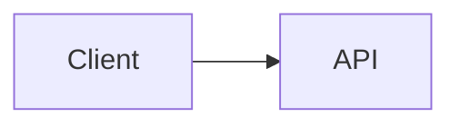

# Architecture — [Customer Name]

## 0. Audience (partner side)

This pre-sales architecture is intended to be useful to:

- **Solution architect / pre-sales architect** (story, tradeoffs, gates)
- **Infra/platform engineer** (networking, identity boundaries, operations)
- **App developer / lead engineer** (integration surfaces, tool calls, data flows)
- **Security/compliance lead** (data handling, auditability, retention)

## 1. Executive summary (SA-facing)

- **What we are building:** [TBD]
- **Who it serves:** [TBD]
- **What success looks like:** [TBD]
- **What is explicitly out of scope:** [TBD]

## 2. Scope and assumptions

### 2.1 PoC scope
- [TBD]

### 2.2 Pilot scope
- [TBD]

### 2.3 Production / peak scope
- [TBD]

### 2.4 Key assumptions
- [TBD — ask customer]

## 3. Gating decisions (must resolve before build)

List the unresolved red flags and decisions that block moving forward.

- [TBD — copy from 02-challenges.md red flags]

## 4. Reference architecture (logical)

### 4.1 Logical component diagram

### 4.2 Key runtime flows

- **User chat flow:** [TBD]
- **Retrieval (RAG) flow:** [TBD]
- **Tool calling flow:** [TBD]

## 5. Identity (end-to-end)

Describe the full request path and enforcement points:

- **Customer identity vs associate identity:** [TBD — ask customer]
- **Token flow (JWT):** [TBD]
- **Where token is validated:** [TBD]
- **Server-side authorization model:** [TBD]
- **Service-to-service identity:** [TBD]

All identity claims must be grounded in Microsoft Learn.

## 6. Monitoring and observability

Specify:

- What telemetry is collected for chat API, orchestration, tool calls, retrieval, and identity events
- Minimum dashboards and alerting (latency, error rate, dependency health)
- What must not be logged (PII) [TBD — ask customer]
- Retention and access controls [TBD — ask customer]

## 7. Governance

Specify:

- Environment separation (PoC/pilot/prod) and promotion gates
- Tool allowlist + approval for high-risk tools (for example WISMO)
- Data handling rules for prompts, retrieval indexes, transcripts [TBD — ask customer]
- Policy exceptions process (time-boxed, approved-by) and auditability

## 8. Scaling path (PoC → pilot → production)

- **Phase A — PoC:** [TBD]
- **Phase B — Pilot:** [TBD]
- **Phase C — Production/peak:** [TBD]

## 9. Next workshop agenda (pre-sales)

- **Objective:** close gating decisions and validate architecture assumptions
- **Required attendees:** security/identity owner, app owner, platform/network owner, operations owner [TBD — ask customer]
- **Pre-read:** 01/02/03 artifacts
- **Decisions to make:** [TBD]

## Citations

| Claim | Source | Fetch date |
|---|---|---|
| [TBD] | https://learn.microsoft.com/... | [YYYY-MM-DD] |
