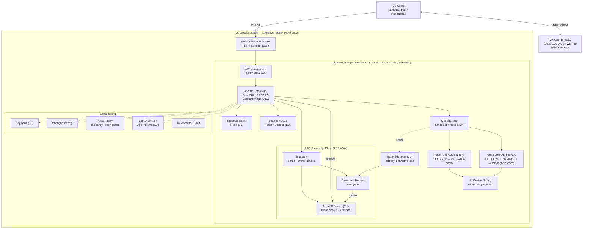
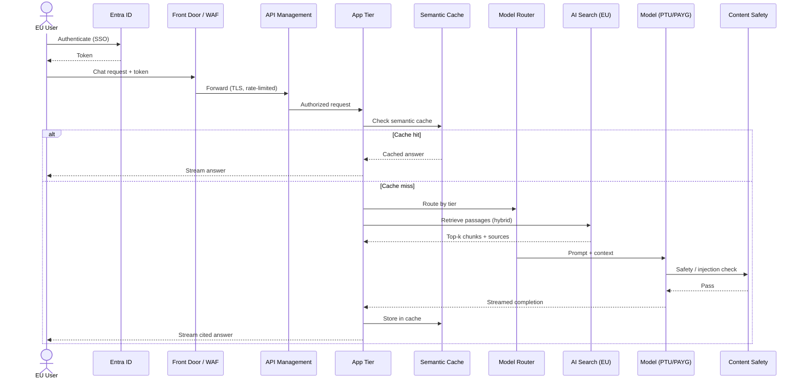
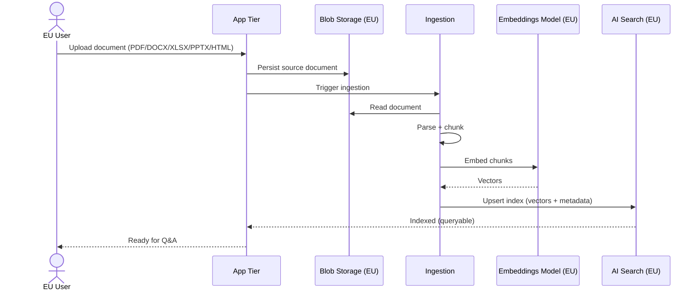
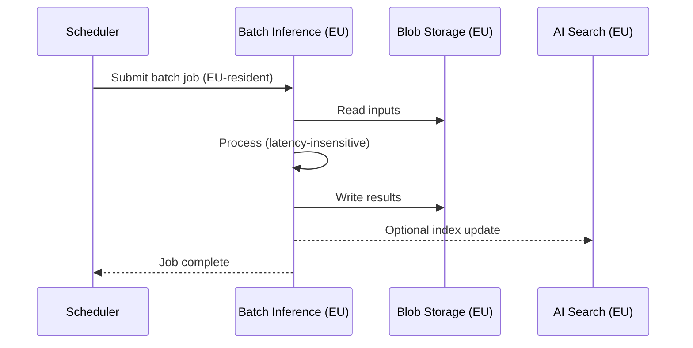
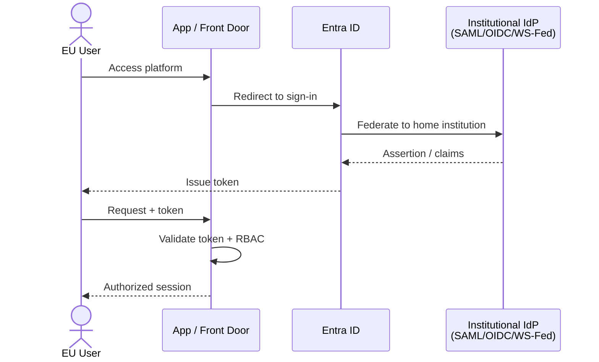

# Sofia Center AI Assistant — Reference Architecture (Mermaid)

> Source: [PRD](prds/sofia-center-ai-assistant.md) · ADRs [0001](decisions/2026-06-15-lightweight-landing-zone.md) · [0002](decisions/2026-06-15-eu-region-residency.md) · [0003](decisions/2026-06-15-model-capacity-hybrid.md) · [0004](decisions/2026-06-15-rag-vector-store.md)

## System architecture

## Flow 1 — Interactive chat with RAG

## Flow 2 — Document upload & ingestion

## Flow 3 — Batch inference

## Flow 4 — Authentication (federated SSO)

