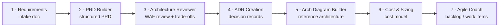

<!-- markdownlint-disable-file -->
# Working with HVE Core — Partner & Customer Positioning Guide

> A practical walkthrough of how Microsoft's **HVE Core** agents and skills take a customer engagement from a rough requirement to a deployable, costed solution design. Uses the **Sofia Center AI Assistant** engagement as the worked example.

## What is HVE Core (in one line)

HVE Core is a set of **specialized AI agents and skills** that run inside VS Code / GitHub Copilot and act like a **virtual pre-sales and solution-design team** — each agent plays a role (Product Manager, Architect, Cost Analyst, Agile Coach) and produces a real, reviewable artifact at each step.

## Why it matters to partners and customers

| Pain today | With HVE Core |
|------------|---------------|
| Pre-sales design is slow, inconsistent, person-dependent | Repeatable, role-based workflow producing standard artifacts |
| Requirements, architecture, and cost live in disconnected docs/heads | One traceable chain: requirements → PRD → ADRs → architecture → cost |
| Assumptions get buried and surprise you later | Every assumption is **explicitly flagged** and tracked to an owner |
| Hard to show the customer *why* a decision was made | **ADRs** capture each decision with options and trade-offs |
| Estimates feel like guesses | Transparent, **assumption-driven** cost model with ranges |

> **Positioning soundbite:** "HVE Core lets a single solution architect produce a full, traceable solution package — PRD, architecture, decision records, and a cost model — in a fraction of the usual time, with every assumption visible to the customer."

## The engagement flow (end to end)



### Step 1 — Capture requirements
**What it is:** A structured intake that records business context, users, AI capabilities, data, NFRs, compliance, and known unknowns.
**Key idea:** It distinguishes **confirmed facts** from **partner assumptions** and **[TBD — ask customer]** items, so nothing is silently invented.
**Artifact:** `01-requirements.md`
**Customer value:** Shows you listened precisely and surfaces gaps early instead of mid-project.

### Step 2 — Build the PRD (PRD Builder agent)
**What it is:** Turns the intake into a **Product Requirements Document** with measurable goals, functional requirements (FR IDs), non-functional requirements (NFR IDs), risks, and open questions.
**Key idea:** Every requirement gets a **traceable ID** and links back to a goal.
**Artifact:** `docs/prds/sofia-center-ai-assistant.md`
**Customer value:** A single, professional definition of *what* is being built and *how success is measured*.

### Step 3 — Architecture review (System Architecture Reviewer agent)
**What it is:** Evaluates the design against the **Well-Architected Framework** (security, reliability, performance, cost), surfaces **trade-offs**, and flags items needing a human/customer decision.
**Key idea:** It scopes to the **highest-impact pillars** rather than boiling the ocean — for Sofia Center: sovereignty, performance, and cost.
**Artifact:** Review findings + trade-off tables.
**Customer value:** Confidence the design is sound *before* money is spent building it.

### Step 4 — Record decisions (ADR Creation agent)
**What it is:** Captures each significant, hard-to-reverse choice as an **Architecture Decision Record** — context, options considered, decision, and consequences.
**Key idea:** Decisions become **auditable and defensible**, not tribal knowledge.
**Artifacts:** `docs/decisions/*.md` (e.g., landing zone, EU region, model capacity, vector store).
**Customer value:** When someone later asks "why did we choose this?", the answer is written down with the alternatives.

### Step 5 — Reference architecture (Arch Diagram Builder agent)
**What it is:** Produces a **detailed architecture diagram** (ASCII and/or Mermaid) plus per-flow sequence diagrams, with every component tied to a requirement or ADR.
**Key idea:** The picture is **traceable** — each box maps to a decision or requirement.
**Artifact:** `docs/architecture/sofia-center-reference-architecture.md`
**Customer value:** A clear, shareable visual the whole stakeholder group can understand.

### Step 6 — Cost & sizing
**What it is:** A **bottom-up, assumption-driven cost model** with low/expected/high ranges and prioritized optimization levers.
**Key idea:** It is **honest about uncertainty** — indicative rates are flagged for validation, and the model re-prices automatically when assumptions are confirmed.
**Artifact:** `docs/cost/sofia-center-cost-model.md`
**Customer value:** A defensible budget conversation grounded in explicit assumptions, not a black-box number.

### Step 7 — Backlog (Agile Coach / Product Manager Advisor agents)
**What it is:** Converts the PRD into **epics, user stories, and work items** with acceptance criteria, ready for Azure DevOps or GitHub.
**Customer value:** A clean handoff from design into delivery.

## The golden thread (traceability)

Everything links together, which is the real differentiator:

```text
Requirement  -->  Goal (G-00x)  -->  FR/NFR ID  -->  ADR  -->  Architecture component  -->  Cost line  -->  Backlog item
```

A customer can pick any cost line or architecture box and trace it back to the requirement that justifies it — and forward to the work item that delivers it.

## How to position this in a partner/customer conversation

1. **Frame it as acceleration, not automation of judgment.** HVE Core does the heavy lifting; the architect stays in control and reviews every artifact.
2. **Lead with traceability and assumptions.** The standout value is that nothing is hidden — assumptions, decisions, and trade-offs are all explicit.
3. **Show the artifacts, not the tool.** Customers care about the PRD, the ADRs, the architecture, and the cost model — show those.
4. **Use it live.** In a workshop you can capture a requirement and produce a first-pass PRD and architecture in the same session.
5. **Emphasize Microsoft alignment.** It bakes in Well-Architected Framework thinking, Azure services, and Cloud Adoption Framework concepts.

## What HVE Core is *not*

- It is **not** a replacement for the architect's judgment — outputs are drafts to review and refine.
- It is **not** a pricing quote engine — cost models are planning estimates to validate against the Azure Pricing Calculator.
- It is **not** a deployment tool by itself — it produces the design; delivery (IaC, build) is the next stage.

## Worked example artifacts (Sofia Center)

| Step | Agent / phase | Artifact |
|------|---------------|----------|
| 1 | Requirements intake | `01-requirements.md` |
| 2 | PRD Builder | `docs/prds/sofia-center-ai-assistant.md` |
| 3 | System Architecture Reviewer | review findings + trade-offs |
| 4 | ADR Creation | `docs/decisions/2026-06-15-*.md` (4 ADRs) |
| 5 | Arch Diagram Builder | `docs/architecture/sofia-center-reference-architecture.md` |
| 6 | Cost & Sizing | `docs/cost/sofia-center-cost-model.md` |
| 7 | Agile Coach (next) | backlog / work items |

## One-slide summary for partners

> **HVE Core = a virtual pre-sales solution team in VS Code.**
> It takes a customer requirement and produces a **traceable solution package** — PRD, decision records, reference architecture, and a transparent cost model — faster and more consistently than manual effort, with **every assumption and trade-off made explicit** so the customer can trust the result.

---

*Reference engagement: Sofia Center AI Assistant Platform (EU-resident, GDPR-compliant AI assistant for ~100k higher-education users). Generated 2026-06-15.*
